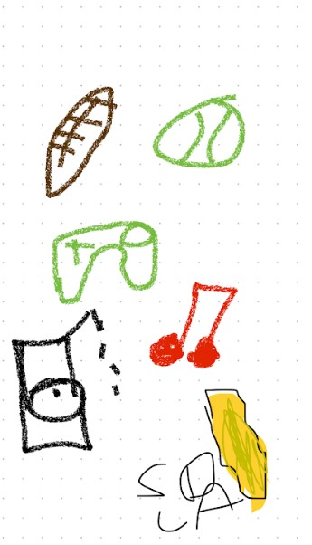

# Eshaan Kumar
## CSA Student Blog

<!-- Theme Switcher Button -->
<button id="themeSwitcher" onclick="switchTheme()">Switch Theme</button>

<button id="notebooks" onclick='toggleNotebooks()'>Open Notebooks</button>

  <button onclick='window.location.href="{{ site.baseurl }}/2024/09/10/SongSearch.html"'>iTunes Music Finder</button>
   
  <button onclick='window.location.href="{{ site.baseurl }}/2024/09/12/HTMLBasics_IPYNB_2_.html"'>HTML Basics</button>
   
  <button onclick='window.location.href="{{ site.baseurl }}/about"'>About Me</button>

<!-- Link to the initial theme stylesheet (dark-theme by default) -->
<link id="themeStylesheet" rel="stylesheet" href="{{ site.baseurl }}/assets/css/dark-theme.css">

